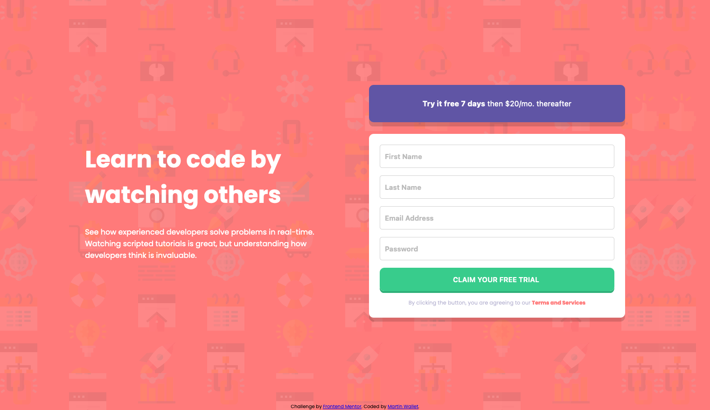

# Frontend Mentor - Intro component with sign up form solution

This is a solution to the [Intro component with sign up form challenge on Frontend Mentor](https://www.frontendmentor.io/challenges/intro-component-with-signup-form-5cf91bd49edda32581d28fd1). Frontend Mentor challenges help you improve your coding skills by building realistic projects.

## Table of contents

- [Overview](#overview)
  - [The challenge](#the-challenge)
  - [Screenshot](#screenshot)
  - [Links](#links)
- [My process](#my-process)
  - [Built with](#built-with)
  - [What I learned](#what-i-learned)
  - [Continued development](#continued-development)
  - [Useful resources](#useful-resources)
- [Author](#author)

## Overview

### The challenge

Users should be able to:

- View the optimal layout for the site depending on their device's screen size
- See hover states for all interactive elements on the page
- Receive an error message when the `form` is submitted if:
  - Any `input` field is empty. The message for this error should say *"[Field Name] cannot be empty"*
  - The email address is not formatted correctly (i.e. a correct email address should have this structure: `name@host.tld`). The message for this error should say *"Looks like this is not an email"*

### Screenshot



### Links

- Solution URL: [GitHub](https://github.com/martinw0/sign-up-form)
- Live Site URL: [GitHub Pages](https://martinw0.github.io/sign-up-form/)

## My process

### Built with

- Semantic HTML5 markup
- CSS custom properties
- Flexbox
- CSS Grid
- Mobile-first workflow

### What I learned

How to skip HTML form validation:

```html
<form novalidate></form>
```

### Continued development

- [Validate forms](https://developer.mozilla.org/fr/docs/Learn/Forms/Form_validation)
- [js form validations](https://www.w3schools.com/js/js_validation.asp)

### Useful resources

## Author

- Frontend Mentor - [@martinw0](https://www.frontendmentor.io/profile/martinw0)
- Twitter - [@LeWalletM](https://www.twitter.com/LeWalletM)
